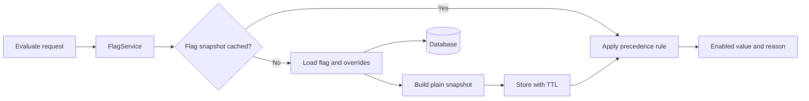

# Milestone 3: Evaluation and Caching

## Target behavior
`GET /flags/{key}/evaluate?user_id=user-123` will return the effective flag state and explain where it came from:

```json
{
  "flag": "checkout_v2",
  "user_id": "user-123",
  "enabled": true,
  "reason": "user_override"
}
```

A user override always wins. If that user has no override, evaluation uses the flag's global state. A missing flag returns the existing `404 flag_not_found` error, and invalid user IDs keep the existing `422 validation_error` format.



## 1. Define and test the evaluation rule
- Add [`app/evaluation.py`](/Users/s-coding-interview/Desktop/do_q3/app/evaluation.py) with a small pure function that accepts the global state and an optional user override.
- Return a typed result containing `enabled` and a reason limited to `user_override` or `global`.
- Check override presence with `is not None`, so an explicit `False` override is not mistaken for a missing override.
- Keep this module independent of FastAPI, SQLAlchemy, and caching.
- Add direct unit tests for all four important combinations: global on/off and override on/off, plus no override.

## 2. Add a bounded, thread-safe cache
- Add `cachetools` to [`requirements.txt`](/Users/s-coding-interview/Desktop/do_q3/requirements.txt).
- Add cache settings to [`app/config.py`](/Users/s-coding-interview/Desktop/do_q3/app/config.py): a 60-second TTL and 1,000-entry maximum by default, both overridable through environment variables and validated as positive values.
- Create [`app/cache.py`](/Users/s-coding-interview/Desktop/do_q3/app/cache.py) containing:
  - An immutable `FlagSnapshot` with only `global_enabled` and a copied `user_id -> enabled` mapping. Do not cache SQLAlchemy objects tied to a request session.
  - A `FlagCache` wrapper around `cachetools.TTLCache`, keyed by flag key.
  - Small `get`, `set`, `invalidate`, and `clear` methods.
  - A lock around cache access because `TTLCache` itself is not thread-safe and FastAPI runs these synchronous handlers in worker threads.
  - One application-level cache instance and a dependency function that returns it, allowing tests to clear or replace it.
- Do not cache missing flags. This avoids making a newly created flag look absent until the TTL expires.

## 3. Load a complete snapshot on a cache miss
- Add `get_flag_with_overrides()` to [`app/repository.py`](/Users/s-coding-interview/Desktop/do_q3/app/repository.py).
- Use an eager `joinedload` and SQLAlchemy's `unique()` handling so one repository call loads the flag and all of its overrides without an N+1 query pattern or later lazy loading.
- Keep snapshot construction out of the repository: the repository returns database models, while the service converts them immediately to plain cache data.
- Add a repository test proving the flag and its override collection are returned together, and that an unknown key returns `None`.

## 4. Add read-through evaluation in the service
- Extend [`app/service.py`](/Users/s-coding-interview/Desktop/do_q3/app/service.py) so `FlagService` receives a `FlagCache` alongside its database session.
- Add `evaluate_flag(key, user_id)` with this flow:
  1. Ask the cache for the flag snapshot.
  2. On a miss, call `get_flag_with_overrides()`.
  3. Raise `FlagNotFoundError` if the flag is absent, without inserting a cache entry.
  4. Copy the global state and overrides into a `FlagSnapshot`, then cache it.
  5. Pass the snapshot values to the pure evaluation function.
  6. Return the effective state, reason, and whether the cache was hit so the route can expose diagnostics without affecting behavior.
- The cache remains an optimization only: the database stays the source of truth.

## 5. Add the evaluation API
- Add `FlagEvaluationResponse` to [`app/schemas.py`](/Users/s-coding-interview/Desktop/do_q3/app/schemas.py), with `reason` restricted by `Literal` to the two supported values.
- Update service dependency construction in [`app/api/flags.py`](/Users/s-coding-interview/Desktop/do_q3/app/api/flags.py) to inject the shared cache.
- Add `GET /flags/{key}/evaluate` and reuse the existing `UserId` type for the required query parameter. This preserves whitespace trimming, the 1–255 character limit, and the standard validation error response.
- Return `X-Cache: MISS` when the database was used and `X-Cache: HIT` for a repeated cached read. Treat this as diagnostic information only; response correctness must not depend on the header.

## 6. Invalidate cached snapshots after successful writes
- Update every relevant mutation in [`app/service.py`](/Users/s-coding-interview/Desktop/do_q3/app/service.py) to invalidate the entry for that flag key only after `session.commit()` succeeds:
  - Any flag update, including description-only changes.
  - Flag deletion.
  - Override creation or replacement.
  - Override deletion.
- Keep invalidation out of routes and the repository so all callers receive the same behavior.
- Do not invalidate before commit or after rollback. Do not add special handling to flag creation because missing flags are not cached.
- Preserve the current rollback behavior if a database operation fails.

## 7. Prove cache behavior and document its limits
- Clear the shared cache before and after API tests in [`tests/conftest.py`](/Users/s-coding-interview/Desktop/do_q3/tests/conftest.py), preventing one test or temporary database from leaking cached values into another.
- Add [`tests/test_evaluation.py`](/Users/s-coding-interview/Desktop/do_q3/tests/test_evaluation.py) covering:
  - Missing flag → `404 flag_not_found`.
  - Missing, blank, and overlong `user_id` → the existing `422 validation_error` shape.
  - Global fallback when no override exists.
  - Both override directions: global off/user on and global on/user off.
  - First evaluation is `MISS`; the repeated evaluation is `HIT` with the same result.
  - A cached global value changes immediately after `PATCH`.
  - Creating or replacing an override changes the next evaluation immediately.
  - Deleting an override immediately falls back to global state.
  - Deleting a cached flag makes the next evaluation return `404`.
- Update [`README.md`](/Users/s-coding-interview/Desktop/do_q3/README.md) with the evaluation request/response, cache defaults and environment settings, invalidation behavior, and the main limitation: each process has its own cache, so separate workers or replicas can briefly disagree until TTL expiry. Note Redis/Valkey with cross-process invalidation as the production scaling path.
- Run `ruff check .` and the full `pytest` suite. Confirm existing management endpoints remain green and the new tests demonstrate hit, miss, precedence, and post-write freshness.

## Completion criteria
- Evaluation always chooses a user override when one exists and otherwise uses the global state.
- Repeated reads use a bounded TTL cache containing plain data rather than ORM objects.
- All relevant successful writes invalidate the correct flag entry; failed writes do not change cache state.
- Cache access is safe across FastAPI worker threads, and tests are isolated from shared cache state.
- The API contract, cache settings, and process-local limitation are documented.
- Ruff and the complete test suite pass.