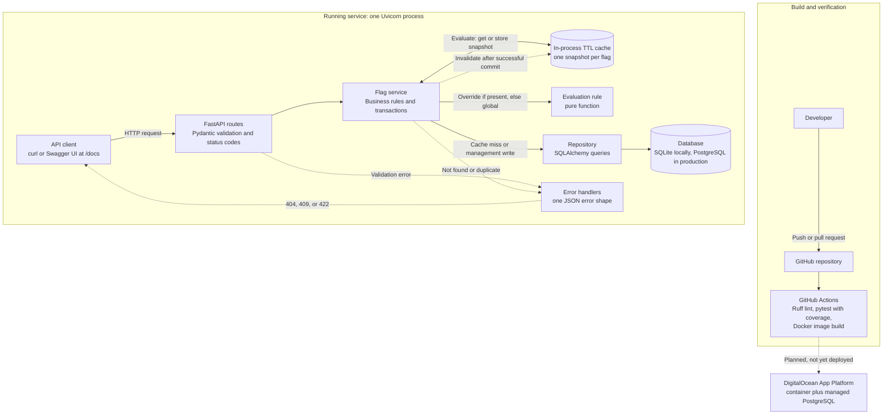
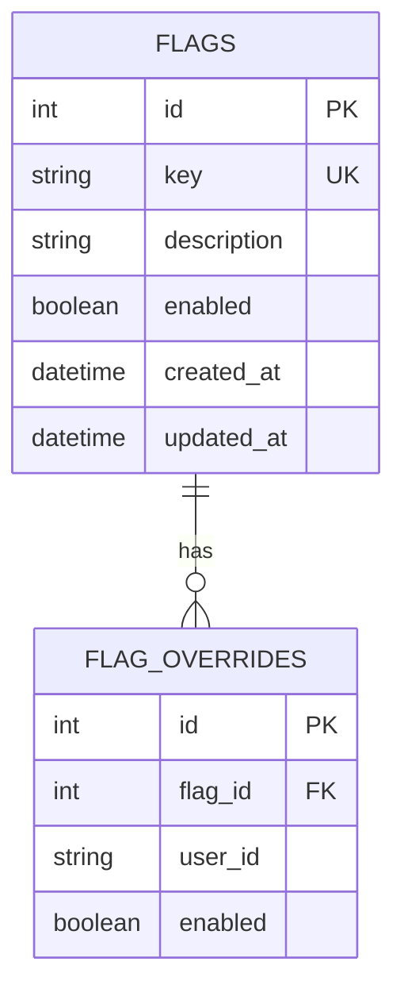
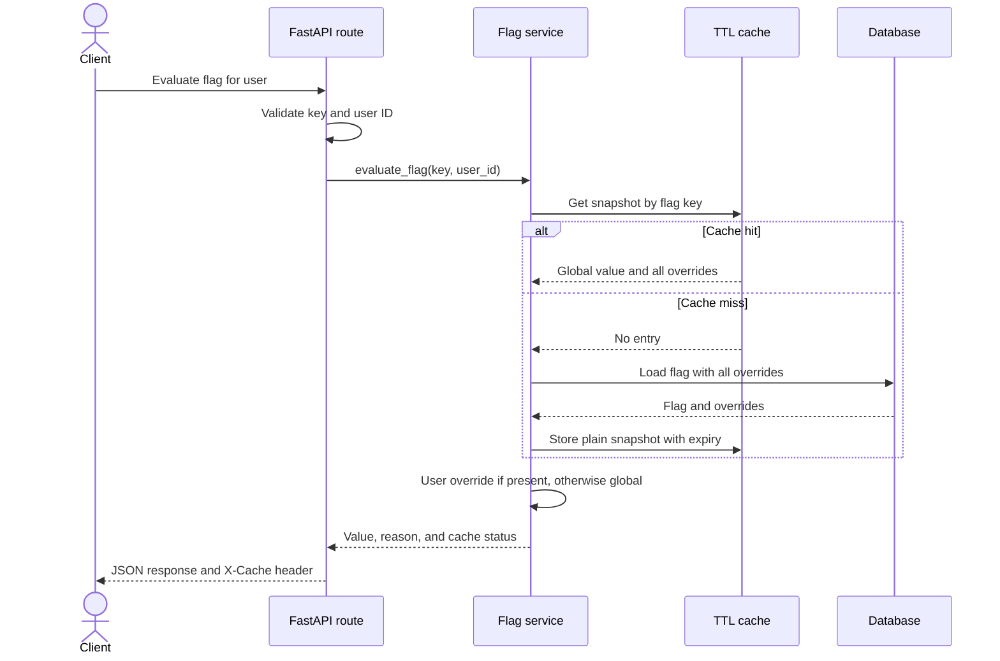

# Feature Flags API Architecture

This document combines the persistence, management API, and evaluation-cache design into one plain-language view. It explains how a request moves through the service, where data is stored, how cached results stay fresh, and how the project is checked before deployment.

## What the service does

A **feature flag** is a named switch that turns an application feature on or off without requiring a new application release. Each flag has:

- A unique key, such as `checkout_v2`.
- A description.
- A global enabled or disabled value.
- Optional per-user overrides.

A **per-user override** is a value for one specific user that takes priority over the flag's global value. For example, a globally disabled feature can still be enabled for a test user.

The service supports:

- Creating, reading, listing, updating, and deleting flags.
- Enabling or disabling a flag for one user.
- Evaluating the final value for a user.
- Caching flag data to make repeated evaluations faster.
- Returning consistent validation and application errors.

## High-level architecture



The service currently runs locally with Uvicorn and a SQLite file. The Dockerfile and the `DATABASE_URL` handling are prepared for DigitalOcean App Platform with a managed PostgreSQL database, but that deployment has not been completed; the dashed box shows the intended production path. Automated tests always use temporary SQLite databases.

## Request path and layer responsibilities

The code is split into layers so each part has one clear job:

1. **FastAPI routes** receive HTTP requests, validate their shape, and choose the response status code. A route is the code connected to an API URL.
2. **Service layer** applies business rules, such as override precedence, missing-resource handling, transaction outcomes, and cache invalidation. A transaction is a group of database changes that either succeeds as a unit or is rolled back.
3. **Repository layer** reads and writes database records. It does not know about HTTP status codes or response formats.
4. **SQLAlchemy models** describe the database tables and their relationship. SQLAlchemy is the library that maps Python objects to database rows; this mapping is often called an **ORM**, or object-relational mapper.
5. **Database** is the permanent source of truth. Cache contents can expire or disappear without losing the saved flag configuration.

FastAPI creates one database session for each request and closes it afterward. A **database session** is the short-lived object used to issue queries and group changes into a transaction.

## Stored data



- `PK` means **primary key**, the unique database identifier for a row.
- `FK` means **foreign key**, a stored reference to a row in another table.
- `UK` means **unique key**, a value the database does not allow to be duplicated.
- The pair of `flag_id` and `user_id` is also unique, so a user cannot have two overrides for the same flag.
- Deleting a flag also deletes all of its overrides. This is called a **cascade delete**.
- Timestamps are produced in UTC so SQLite and PostgreSQL behave consistently.

The application creates missing tables when it starts. This is suitable for this time-boxed project. A larger production system should use Alembic migrations, which are versioned steps for safely changing an existing database schema.

## Management API

The management operations are:

- `POST /flags` — create a flag; returns `201 Created` and a `Location` header.
- `GET /flags` — list flags using `limit` and `offset` for pagination.
- `GET /flags/{key}` — get one flag.
- `PATCH /flags/{key}` — change the description, global enabled value, or both.
- `DELETE /flags/{key}` — delete a flag and its overrides; returns `204 No Content`.
- `PUT /flags/{key}/users/{user_id}` — create or replace a user's override; returns `201` for a new override and `200` for a replacement.
- `DELETE /flags/{key}/users/{user_id}` — remove an override; returns `204 No Content`.

**Pagination** means returning a limited section of a larger list. `limit` controls the maximum number of results and `offset` controls how many earlier results are skipped. Results are ordered by database ID so pages remain predictable.

Important input rules include:

- Flag keys contain lowercase letters, numbers, underscores, or hyphens and are 2–64 characters long.
- Descriptions are at most 500 characters.
- User IDs are trimmed, cannot be blank, and are at most 255 characters.
- Unknown JSON fields are rejected.
- A `PATCH` body cannot be empty and supplied values cannot be `null`.

## Evaluation and override precedence

Clients evaluate a flag with:

```text
GET /flags/{key}/evaluate?user_id={user_id}
```

The rule is intentionally simple:

1. If the user has an override, use it even when its value is `false`.
2. Otherwise, use the flag's global value.

The response explains which rule supplied the value:

```json
{
  "flag": "checkout_v2",
  "user_id": "user-123",
  "enabled": true,
  "reason": "user_override"
}
```

The evaluation rule is a **pure function**: given the same global and override values, it always returns the same result and does not read the database, use the cache, or change external state. This keeps the most important rule easy to test.

## Evaluation sequence



The first evaluation normally returns `X-Cache: MISS`. A repeated evaluation before expiry normally returns `X-Cache: HIT`. The header is diagnostic only; it does not change the result.

## Cache design and freshness

The cache stores one **snapshot** per flag. A snapshot is a plain, immutable copy containing:

- The global enabled value.
- A mapping from user IDs to their override values.

The cache does not store live SQLAlchemy objects because those objects belong to a request's database session. Keeping plain copied data prevents later access to a closed session.

The cache is:

- **In-process**: it exists in the memory of one running application process.
- **Bounded**: it holds at most 1,000 flags by default.
- **TTL-based**: entries expire after 60 seconds by default. TTL means **time to live**, or how long an entry may remain cached.
- **Thread-safe**: access is protected by a lock because synchronous FastAPI handlers may run in different worker threads.
- **Read-through**: on a cache miss, the service reads the database and then fills the cache.

`CACHE_MAX_ENTRIES` and `CACHE_TTL_SECONDS` change the default size and expiry.

Missing flags are not cached. If a missing flag is created immediately afterward, the next evaluation can therefore find it without waiting for an old “not found” result to expire.

After a successful flag update or deletion, or an override creation, replacement, or deletion, the service invalidates that flag's snapshot. **Invalidation** means removing cached data because it may now be stale. Invalidation happens only after the database commit succeeds. A failed write is rolled back and does not alter the cache.

Each process has its own cache. With multiple application replicas, one replica can briefly retain old data after another replica handles a write. A production scaling path is Redis or Valkey, which provide a shared cache, together with cross-process invalidation notifications.

## Errors and HTTP behavior

Expected errors use one safe shape:

```json
{
  "error": {
    "code": "flag_not_found",
    "message": "Flag 'checkout_v2' was not found"
  }
}
```

- `404 Not Found` means the requested flag or override does not exist.
- `409 Conflict` means a new flag duplicates an existing key.
- `422 Unprocessable Content` means request validation failed.
- Failed database writes are rolled back so a partial change is not left behind.
- Internal database messages and stack traces are not returned to clients.

## Local and production storage

- Local development defaults to `sqlite:///./feature_flags.db`.
- Tests use fresh temporary SQLite databases to keep tests isolated.
- Production should set `DATABASE_URL` to its PostgreSQL connection string.
- PostgreSQL URLs beginning with `postgres://` or `postgresql://` are converted to the SQLAlchemy psycopg driver format automatically.

SQLite is a small database stored in a local file. PostgreSQL is a separate database server suited to persistent production workloads. Both are accessed through the same repository and service code.

## Tests and delivery flow

The automated test suite covers:

- Repository create, read, update, and delete behavior.
- Unique flag keys and unique per-user overrides.
- Cascade deletion.
- API validation, status codes, headers, and error shapes.
- Global fallback and both override directions.
- Cache hits, misses, expiry-safe behavior, and write invalidation.
- Test database and cache isolation.

GitHub Actions runs on pushes and pull requests. It:

1. Installs Python and project dependencies.
2. runs Ruff, a Python linter that finds style problems and likely mistakes;
3. runs pytest with coverage, which reports how much application code the tests execute; and
4. builds the Docker container image.

A **container image** is a packaged filesystem and startup configuration used to run the service consistently across environments. Passing CI means these automated checks completed successfully; it does not by itself prove that a production deployment is healthy.

## Key design tradeoffs

- Startup table creation keeps setup simple, but Alembic migrations are safer for future schema changes.
- An in-process cache is fast and requires no extra service, but a shared cache is needed for immediate consistency across replicas.
- The layer boundaries keep HTTP, business rules, and database work separate, but add a small amount of structure to a compact service.
- Authentication and authorization are not included. A production management API should restrict who can change flags.
- Production hardening should also add structured logs, metrics, tracing, rate limits, backups, and database migration checks.

## Glossary

- **API**: a defined way for software clients to send requests to a service and receive responses.
- **Cache hit**: the requested data was found in the cache.
- **Cache miss**: the requested data was not in the cache and had to be loaded from the database.
- **Commit**: make a database transaction permanent.
- **CRUD**: create, read, update, and delete.
- **Dependency injection**: supplying objects such as a database session or cache to code that needs them, instead of creating them inside that code.
- **Endpoint**: one HTTP method and URL exposed by an API.
- **Environment variable**: a named setting supplied outside the source code, such as `DATABASE_URL`.
- **Eager loading**: loading a record and its related data in one planned database operation.
- **HTTP status code**: a number such as `200`, `404`, or `422` that summarizes the outcome of a request.
- **Linting**: automated checks for code style problems and suspicious code.
- **Replica**: another running copy of the application used for capacity or availability.
- **Rollback**: cancel the uncommitted changes in a failed database transaction.
- **Source of truth**: the authoritative place where data is stored; here, that is the database.

## Testing locally

### Start the service

```bash
rm -f feature_flags.db
CACHE_TTL_SECONDS=15 .venv/bin/uvicorn app.main:app --reload --port 8000
```

Removing `feature_flags.db` starts with an empty database. A short `CACHE_TTL_SECONDS` makes cache expiry easy to observe.

### Option 1: Swagger UI

Open `http://localhost:8000/docs`, where you can click through each endpoint, fill in request bodies, and inspect responses and headers.

### Option 2: Terminal

Run these commands in a second terminal window, in order. `-i` prints the response status and headers, including `X-Cache`.

```bash
B=http://localhost:8000
```

**1. Create a flag.** Returns `201 Created` with a `Location` header.

```bash
curl -i -X POST $B/flags -H 'Content-Type: application/json' \
  -d '{"key":"checkout_v2","description":"New checkout","enabled":false}'
```

**2. Evaluate, then evaluate again.** The first call returns `X-Cache: MISS`, `reason: global`, and `enabled: false`. The repeat returns `X-Cache: HIT`.

```bash
curl -i "$B/flags/checkout_v2/evaluate?user_id=alice"
curl -i "$B/flags/checkout_v2/evaluate?user_id=alice"
```

**3. Add an override for alice.** Returns `201 Created` and clears the flag's cached entry.

```bash
curl -i -X PUT $B/flags/checkout_v2/users/alice \
  -H 'Content-Type: application/json' -d '{"enabled":true}'
```

**4. Evaluate alice and bob.** Alice now gets `X-Cache: MISS`, `enabled: true`, and `reason: user_override`. Bob has no override, so he still gets the global value.

```bash
curl -i "$B/flags/checkout_v2/evaluate?user_id=alice"
curl -i "$B/flags/checkout_v2/evaluate?user_id=bob"
```

**5. Change the flag globally.** Returns `200 OK` and clears the cached entry.

```bash
curl -i -X PATCH $B/flags/checkout_v2 \
  -H 'Content-Type: application/json' -d '{"enabled":true}'
```

**6. Trigger errors.** A duplicate key returns `409 Conflict`, an invalid key returns `422`, and a missing flag returns `404 Not Found`, each with the JSON error shape described above.

```bash
curl -i -X POST $B/flags -H 'Content-Type: application/json' -d '{"key":"checkout_v2"}'
curl -i -X POST $B/flags -H 'Content-Type: application/json' -d '{"key":"BAD KEY"}'
curl -i $B/flags/missing
```

### Summary of expected results

| Step | Request | Expected result |
| --- | --- | --- |
| 1 | Create flag | `201`, `Location: /flags/checkout_v2` |
| 2 | Evaluate twice | `MISS` then `HIT`, `reason: global`, `enabled: false` |
| 3 | Add override for alice | `201`, cache invalidated |
| 4 | Evaluate alice and bob | Alice `enabled: true` via `user_override`; bob uses the global value |
| 5 | Change flag globally | `200`, cache invalidated |
| 6 | Duplicate, invalid key, missing flag | `409`, `422`, `404` |

### Automated checks

```bash
.venv/bin/ruff check .
.venv/bin/pytest --cov=app --cov-report=term-missing
```

