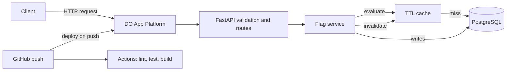

# Feature Flags Service — Three-Hour Implementation Plan

## Objective

Build, test, document, and deploy a production-minded REST API that:

- Stores feature flags persistently.
- Supports global flag state and per-user overrides.
- Evaluates a flag for a specific user.
- Uses caching to improve evaluation performance.
- Returns consistent validation errors and HTTP status codes.
- Includes automated tests, CI, architecture documentation, and a live DigitalOcean URL.

## Time and Scope Strategy

- **Total time:** 3 hours.
- Commit at the end of every milestone so the repository is always submittable.
- If a milestone runs more than 10 minutes over, reduce scope instead of consuming the final buffer.
- Prioritize a deployed, tested, and documented core over unfinished stretch features.
- Keep the first implementation simple enough to explain during review.

## Proposed Project Structure

```text
feature-flags/
├── .do/
│   └── app.yaml
├── .github/
│   └── workflows/
│       └── ci.yml
├── app/
│   ├── api/
│   │   ├── __init__.py
│   │   └── flags.py
│   ├── __init__.py
│   ├── cache.py
│   ├── config.py
│   ├── database.py
│   ├── errors.py
│   ├── main.py
│   ├── models.py
│   ├── repository.py
│   ├── schemas.py
│   └── service.py
├── docs/
│   └── architecture.md
├── tests/
│   ├── conftest.py
│   ├── test_evaluation.py
│   └── test_flags_api.py
├── .dockerignore
├── .gitignore
├── Dockerfile
├── README.md
├── requirements.txt
└── requirements-dev.txt
```

---

## Milestone 0: Setup and Hello-World Deploy (0:00–0:25)

### Goal

Obtain a live URL that returns HTTP `200` before implementing application logic. DigitalOcean's first App Platform build may be slow, so start it as early as possible.

### Step 1: Authenticate and create the repository (0:00–0:05)

- [ ] Open a terminal in the bridged development container.
- [ ] Confirm the working path is under `/workspaces`.
- [ ] Authenticate with GitHub:

  ```bash
  gh auth login
  ```

- [ ] Create and clone the public repository:

  ```bash
  cd /workspaces
  gh repo create feature-flags --public --clone
  cd feature-flags
  ```

- [ ] Verify the remote:

  ```bash
  git remote -v
  ```

- [ ] Add a minimal `README.md`, make the initial commit, and push immediately.
- [ ] Confirm the repository is visible in the browser.

### Step 2: Create the minimal FastAPI application (0:05–0:10)

- [ ] Create `app/__init__.py`.
- [ ] Create `app/main.py`.
- [ ] Instantiate the FastAPI application.
- [ ] Add `GET /healthz`.
- [ ] Return a small stable response such as:

  ```json
  {"status": "ok"}
  ```

- [ ] Add a root endpoint only if useful; `/healthz` is the required deployment check.
- [ ] Create `requirements.txt` with pinned or bounded runtime dependencies:
  - `fastapi`
  - `uvicorn[standard]`
- [ ] Run the application locally:

  ```bash
  uvicorn app.main:app --reload
  ```

- [ ] Verify:

  ```bash
  curl -i http://localhost:8000/healthz
  ```

- [ ] Confirm the response is `200 OK`.

### Step 3: Containerize the application with OrbStack (0:10–0:15)

- [ ] Install and start OrbStack on macOS if it is not already running.
- [ ] Confirm the Docker-compatible CLI is connected to OrbStack:

  ```bash
  docker context show
  docker info
  ```

- [ ] Keep using the standard `docker` CLI commands below; OrbStack provides the local container engine that executes them.
- [ ] Create a `Dockerfile` based on `python:3.12-slim`.
- [ ] Set a working directory.
- [ ] Copy and install `requirements.txt` before copying application code to improve layer caching.
- [ ] Avoid running as root if time permits; otherwise record this as future hardening.
- [ ] Use the App Platform `PORT` environment variable:

  ```bash
  uvicorn app.main:app --host 0.0.0.0 --port "${PORT:-8080}"
  ```

- [ ] Create `.dockerignore` excluding:
  - `.git`
  - `.venv`
  - `__pycache__`
  - `.pytest_cache`
  - coverage output
  - local database files
- [ ] Create `.gitignore` for the same development artifacts and `.env`.
- [ ] Build locally using OrbStack:

  ```bash
  docker build -t feature-flags .
  ```

- [ ] Run the image on OrbStack:

  ```bash
  docker run --rm -p 8080:8080 -e PORT=8080 feature-flags
  ```

- [ ] Confirm `curl http://localhost:8080/healthz` succeeds.

### Step 4: Configure DigitalOcean App Platform (0:15–0:21)

- [ ] Authenticate:

  ```bash
  doctl auth init
  ```

- [ ] Create `.do/app.yaml`.
- [ ] Configure:
  - A single web service.
  - The GitHub repository and branch.
  - Dockerfile-based builds.
  - `github.deploy_on_push: true`.
  - HTTP port matching the container.
  - Health check path `/healthz`.
  - One small instance.
- [ ] Create the app:

  ```bash
  doctl apps create --spec .do/app.yaml
  ```

- [ ] If repository access fails, connect the GitHub account to DigitalOcean once in the browser and retry.
- [ ] Record the app ID from the command output.
- [ ] Inspect deployment status:

  ```bash
  doctl apps list
  doctl apps get <app-id>
  ```

### Step 5: Push and verify deployment (0:21–0:25)

- [ ] Commit all deployment skeleton files:

  ```bash
  git add .
  git commit -m "hello world + deploy pipeline"
  git push
  ```

- [ ] Allow the deployment to continue in the background while starting Milestone 1.
- [ ] Once available, retrieve the live URL and run:

  ```bash
  curl -i https://<app-url>/healthz
  ```

- [ ] Confirm the live response is `200`.

### Deployment Caveat

App Platform's filesystem is ephemeral. A local SQLite file can be used for development and tests but will not provide durable production storage. Plan to attach a DigitalOcean-managed PostgreSQL development database before the final deployment.

### Exit Criteria

- Repository exists and has been pushed.
- Local and containerized `/healthz` return `200`.
- App Platform deployment has started.
- Ideally, the live URL already returns `200`.

---

## Milestone 1: Data Model and Persistence (0:25–0:55)

### Goal

Create a clean persistence layer that uses PostgreSQL in production and SQLite locally and in tests.

### Step 1: Add dependencies and configuration (0:25–0:30)

- [ ] Add runtime dependencies:
  - `sqlalchemy>=2`
  - PostgreSQL driver such as `psycopg[binary]`
  - `pydantic-settings` if configuration is extracted into a settings class
- [ ] Add `app/config.py`.
- [ ] Read `DATABASE_URL` from the environment.
- [ ] Use a safe local default such as `sqlite:///./feature_flags.db`.
- [ ] Do not commit credentials or `.env` files.
- [ ] Document the expected production environment variable.

### Step 2: Configure SQLAlchemy (0:30–0:35)

- [ ] Create `app/database.py`.
- [ ] Build the SQLAlchemy engine from `DATABASE_URL`.
- [ ] For SQLite, set `check_same_thread=False`.
- [ ] Create a `sessionmaker`.
- [ ] Implement a FastAPI dependency that:
  - Opens a session.
  - Yields it to the route.
  - Closes it in `finally`.
- [ ] Use SQLAlchemy 2.0 declarative models and typed `Mapped` columns.

### Step 3: Define the `flags` table (0:35–0:41)

- [ ] Create `app/models.py`.
- [ ] Add a `Flag` model with:
  - `id`: integer primary key.
  - `key`: non-null string, unique and indexed.
  - `description`: bounded string or text.
  - `enabled`: non-null boolean with a default.
  - `created_at`: timezone-aware timestamp.
  - `updated_at`: timezone-aware timestamp updated on changes.
- [ ] Decide whether timestamps are generated by the application or database, and apply that choice consistently.
- [ ] Add a relationship to user overrides.

### Step 4: Define the `flag_overrides` table (0:41–0:46)

- [ ] Add a `FlagOverride` model with:
  - `id`: optional surrogate primary key, or use a composite key.
  - `flag_id`: foreign key to `flags.id`.
  - `user_id`: non-null bounded string.
  - `enabled`: non-null boolean.
- [ ] Add `ON DELETE CASCADE` to `flag_id`.
- [ ] Add a unique constraint on `(flag_id, user_id)`.
- [ ] Configure ORM cascade behavior so deleting a flag removes loaded child objects correctly.
- [ ] Enable SQLite foreign keys on connection so cascade behavior is actually tested locally.

### Step 5: Create schemas and repository boundaries (0:46–0:52)

- [ ] Create `app/schemas.py` for Pydantic request and response models.
- [ ] Keep API schemas separate from ORM models.
- [ ] Create `app/repository.py`.
- [ ] Add small database access methods for:
  - Creating a flag.
  - Looking up a flag by key.
  - Listing flags with offset and limit.
  - Updating and deleting a flag.
  - Creating or replacing an override.
  - Looking up and deleting an override.
- [ ] Keep HTTP concerns out of the repository.
- [ ] Create `app/service.py` as the future home for business rules and cache coordination.

### Step 6: Initialize and verify the schema (0:52–0:55)

- [ ] Call `Base.metadata.create_all()` during FastAPI startup or lifespan.
- [ ] Start the app against SQLite.
- [ ] Confirm the tables are created.
- [ ] Perform a temporary insert/read check through SQLAlchemy or an early endpoint.
- [ ] Record Alembic migrations as known future work.

### Review Talking Point

`create_all()` is appropriate for a time-boxed prototype, but it does not safely evolve existing production schemas. A production service should use versioned Alembic migrations, reviewed migration scripts, and a deployment process that applies migrations before incompatible application changes.

### Exit Criteria

- App starts with SQLite.
- Both tables and constraints exist.
- PostgreSQL can be selected through `DATABASE_URL`.
- Persistence, service, schema, and API responsibilities have clear file boundaries.

### Suggested Commit

```bash
git commit -am "add feature flag persistence model"
```

---

## Milestone 2: Management API, Validation, and Status Codes (0:55–1:30)

### Goal

Implement a predictable management API with strict validation, consistent errors, and correct status codes.

### API Contract

| Endpoint | Success | Expected errors |
| --- | --- | --- |
| `POST /flags` | `201` with `Location` | `409` duplicate, `422` invalid input |
| `GET /flags` | `200` | `422` invalid pagination |
| `GET /flags/{key}` | `200` | `404` missing flag |
| `PATCH /flags/{key}` | `200` | `404`, `422` |
| `DELETE /flags/{key}` | `204` | `404` |
| `PUT /flags/{key}/users/{user_id}` | `200`, or `201` when new | `404` flag, `422` |
| `DELETE /flags/{key}/users/{user_id}` | `204` | `404` flag or override |

### Step 1: Define strict request and response schemas (0:55–1:02)

- [ ] Define `FlagCreate`.
- [ ] Define `FlagUpdate` with optional `description` and `enabled`.
- [ ] Reject an empty PATCH body.
- [ ] Define `OverrideUpsert` with a required boolean `enabled`.
- [ ] Define response schemas for flags and overrides.
- [ ] Forbid unknown fields using Pydantic model configuration.
- [ ] Cap description length, for example at 500 characters.
- [ ] Validate keys using:

  ```text
  ^[a-z0-9][a-z0-9_-]{1,63}$
  ```

- [ ] Note that this pattern requires keys to be between 2 and 64 characters.
- [ ] Decide whether one-character keys should be valid; if yes, use `{0,63}` instead and document the choice.
- [ ] Trim `user_id`.
- [ ] Reject empty or whitespace-only `user_id`.
- [ ] Set a reasonable maximum `user_id` length.

### Step 2: Establish one error contract (1:02–1:07)

- [ ] Create `app/errors.py`.
- [ ] Use one response shape:

  ```json
  {
    "error": {
      "code": "flag_not_found",
      "message": "Flag 'checkout_v2' was not found"
    }
  }
  ```

- [ ] Add application exceptions for:
  - Missing flag.
  - Missing override.
  - Duplicate flag key.
  - Invalid business operation.
- [ ] Register FastAPI exception handlers.
- [ ] Convert request validation errors to the same outer error shape.
- [ ] Avoid exposing stack traces or database details.
- [ ] Catch `IntegrityError` around commits, roll back the session, and return `409` for duplicate keys.

### Step 3: Implement flag CRUD (1:07–1:18)

- [ ] `POST /flags`
  - Validate the body.
  - Create the flag through the service.
  - Return `201 Created`.
  - Set `Location: /flags/{key}`.
- [ ] `GET /flags`
  - Add `limit` and `offset`.
  - Set conservative bounds, such as `1 <= limit <= 100` and `offset >= 0`.
  - Return a stable ordering, such as creation time then ID.
  - Optionally return pagination metadata if it does not threaten the schedule.
- [ ] `GET /flags/{key}`
  - Return the flag.
  - Return `404` if absent.
- [ ] `PATCH /flags/{key}`
  - Update only provided fields.
  - Do not permit key changes unless explicitly designed.
  - Refresh and return the updated resource.
- [ ] `DELETE /flags/{key}`
  - Delete the flag and dependent overrides.
  - Return an empty `204` response.

### Step 4: Implement per-user override management (1:18–1:26)

- [ ] `PUT /flags/{key}/users/{user_id}`
  - Confirm the flag exists.
  - Normalize and validate `user_id`.
  - Create an override if absent.
  - Replace its state if present.
  - Return `201` for create and `200` for update if practical.
  - If dynamically selecting `200` versus `201` adds excessive complexity, return a documented consistent `200`.
- [ ] `DELETE /flags/{key}/users/{user_id}`
  - Confirm the flag exists.
  - Delete the override.
  - Return `404` if it does not exist.
  - Return empty `204` on success.

### Step 5: Manual API verification (1:26–1:30)

- [ ] Create a flag with `curl`.
- [ ] Attempt to create the same key and confirm `409`.
- [ ] List and retrieve the flag.
- [ ] Patch its description and global state.
- [ ] Create and update a user override.
- [ ] Delete the override.
- [ ] Delete the flag.
- [ ] Send invalid fields and confirm `422`.
- [ ] Confirm every error uses the standard shape.

### Exit Criteria

- Every required management endpoint works.
- Validation is strict and documented.
- Duplicate keys never surface as `500`.
- Database errors roll back cleanly.
- Success and error status codes match the API contract.

### Suggested Commit

```bash
git commit -am "implement flag management API"
```

---

## Milestone 3: Evaluation and Caching (1:30–1:55)

### Goal

Evaluate flags correctly and accelerate repeated reads with an invalidated in-process TTL cache.

### Step 1: Implement the pure evaluation rule (1:30–1:35)

- [ ] Add a small pure function that accepts:
  - Global enabled state.
  - Optional user override state.
- [ ] Return both the effective boolean and reason.
- [ ] Apply this precedence:
  1. If an override exists, use it.
  2. Otherwise, use the global state.
- [ ] Keep the function independent of FastAPI, SQLAlchemy, and the cache so it is easy to unit test.

### Step 2: Add the evaluation endpoint (1:35–1:41)

- [ ] Implement:

  ```text
  GET /flags/{key}/evaluate?user_id=...
  ```

- [ ] Validate and normalize `user_id`.
- [ ] Return `404` if the flag does not exist.
- [ ] Return:

  ```json
  {
    "flag": "checkout_v2",
    "user_id": "user-123",
    "enabled": true,
    "reason": "user_override"
  }
  ```

- [ ] Restrict `reason` to:
  - `user_override`
  - `global`

### Step 3: Add the cache abstraction (1:41–1:47)

- [ ] Add `cachetools` to runtime dependencies.
- [ ] Create `app/cache.py`.
- [ ] Configure a bounded `TTLCache`, for example:
  - TTL: 30–60 seconds.
  - Maximum entries: 1,000 or another documented bound.
- [ ] Key entries by flag key.
- [ ] Store:
  - Global enabled state.
  - A map of `user_id -> enabled` overrides.
- [ ] Use a small typed cache value instead of returning ORM objects outside their session.
- [ ] Encapsulate cache reads, writes, and invalidation behind methods.

### Step 4: Integrate read-through behavior (1:47–1:51)

- [ ] On evaluation:
  1. Look up the flag key in the cache.
  2. On hit, evaluate using cached data.
  3. On miss, load the flag and overrides in one database operation.
  4. Insert the snapshot into the cache.
  5. Evaluate from that snapshot.
- [ ] Ensure a missing flag is not accidentally cached forever.
- [ ] Optionally add `X-Cache: HIT` or `X-Cache: MISS`.
- [ ] Do not make application behavior depend on this diagnostic header.

### Step 5: Invalidate on every relevant write (1:51–1:55)

- [ ] Invalidate the flag-key entry after:
  - Updating global state.
  - Updating description, for simple consistent write behavior.
  - Creating an override.
  - Updating an override.
  - Deleting an override.
  - Deleting the flag.
- [ ] Invalidate only after a successful database commit.
- [ ] Confirm a global toggle is visible immediately after an entry has been cached.
- [ ] Confirm deleting an override immediately falls back to global state.

### Cache Design Notes

- The TTL is a safety net; explicit write invalidation provides normal freshness.
- The cache is process-local and is not shared between replicas.
- With multiple application instances, one instance can briefly retain stale state after another instance writes.
- A scaled version should use Redis/Valkey and pub/sub or version-based invalidation.
- Cache stampede protection and negative caching are possible future improvements, not core requirements.

### Exit Criteria

- Override precedence is correct.
- Repeated evaluations can use a cached snapshot.
- Every flag-related write invalidates the appropriate entry.
- The limitations of an in-process cache are documented.

### Suggested Commit

```bash
git commit -am "add flag evaluation and TTL cache"
```

---

## Milestone 4: Tests and CI (1:55–2:25)

### Goal

Demonstrate correctness with isolated tests and enforce it on every push and pull request.

### Step 1: Build the test fixture (1:55–2:02)

- [ ] Add development dependencies:
  - `pytest`
  - `pytest-cov`
  - `httpx`
  - `ruff`
- [ ] Create `tests/conftest.py`.
- [ ] Use a fresh SQLite database for each test.
- [ ] Prefer a temporary file database for realistic multi-connection behavior, or configure an in-memory database with `StaticPool`.
- [ ] Enable SQLite foreign key enforcement.
- [ ] Override the application's database-session dependency.
- [ ] Clear the process cache before and after each test.
- [ ] Yield a FastAPI `TestClient`.
- [ ] Ensure tables and temporary files are removed during teardown.

### Step 2: Test CRUD and API errors (2:02–2:10)

- [ ] Test creating, retrieving, listing, patching, and deleting a flag.
- [ ] Assert the creation response is `201`.
- [ ] Assert the `Location` header is correct.
- [ ] Assert a duplicate key returns `409`.
- [ ] Assert a missing flag returns `404`.
- [ ] Assert malformed keys return `422`.
- [ ] Assert extra request fields return `422`.
- [ ] Assert invalid pagination returns `422`.
- [ ] Assert the common error shape, not only status codes.

### Step 3: Test overrides and evaluation (2:10–2:17)

- [ ] Test that a user override wins over global state.
- [ ] Test both override directions:
  - Globally off, user on.
  - Globally on, user off.
- [ ] Delete the override and confirm evaluation falls back to global.
- [ ] Cache an evaluation, toggle the global value, and evaluate again.
- [ ] Confirm the second evaluation reflects the update, proving invalidation.
- [ ] Delete a flag with overrides.
- [ ] Confirm the overrides are removed through cascade behavior.
- [ ] Add a direct unit test for the pure evaluation function.

### Step 4: Add lint and coverage commands (2:17–2:20)

- [ ] Configure Ruff in `pyproject.toml` if useful.
- [ ] Run:

  ```bash
  # These container commands run through OrbStack.
  ruff check .
  pytest --cov=app --cov-report=term-missing
  docker build -t feature-flags .
  ```

- [ ] Fix failures before adding CI.
- [ ] Avoid chasing an arbitrary 100% coverage target; prioritize important behavior and failure paths.

### Step 5: Add GitHub Actions (2:20–2:25)

- [ ] Create `.github/workflows/ci.yml`.
- [ ] Trigger on pushes and pull requests.
- [ ] Check out the repository.
- [ ] Set up Python 3.12 with dependency caching.
- [ ] Install runtime and development dependencies.
- [ ] Run `ruff check`.
- [ ] Run tests with coverage.
- [ ] Build the container image with OrbStack.
- [ ] Push the workflow.
- [ ] Open the Actions tab and confirm the run starts.
- [ ] Fix any environmental differences exposed by CI.

### Exit Criteria

- Required behaviors and key errors are tested.
- Tests are isolated and deterministic.
- Lint, test, coverage, and the OrbStack-backed container build pass locally.
- GitHub Actions is green or actively running with enough time left to fix it.

### Suggested Commit

```bash
git commit -am "add automated tests and CI"
```

---

## Milestone 5: Diagram, README, and Production Deploy (2:25–2:45)

### Goal

Make the project reviewable, attach persistent production storage, and smoke-test the deployed service.

### Step 1: Create the architecture diagram (2:25–2:30)

- [ ] Create `docs/architecture.md`.
- [ ] Add a Mermaid flowchart showing:
  - Client.
  - DigitalOcean App Platform.
  - FastAPI validation and routing.
  - Flag service.
  - TTL cache.
  - PostgreSQL.
  - GitHub push.
  - GitHub Actions lint/test/build.
- [ ] Label important flows:
  - Evaluate request.
  - Cache hit.
  - Cache miss.
  - Database read.
  - Management write.
  - Cache invalidation.
- [ ] Check Mermaid syntax in GitHub after pushing.

Example logical flow:



### Step 2: Add an evaluation sequence diagram (2:30–2:33)

- [ ] Show the cache-hit path.
- [ ] Show the cache-miss path and database load.
- [ ] Show how the service applies override precedence.
- [ ] Keep the sequence short enough to explain in under two minutes.

### Step 3: Complete the README (2:33–2:39)

- [ ] Add an overview and key capabilities.
- [ ] Link to `docs/architecture.md`.
- [ ] Describe the project structure.
- [ ] Add an API table with status codes.
- [ ] Add `curl` examples for:
  - Creating a flag.
  - Globally toggling it.
  - Setting a user override.
  - Evaluating it.
  - Removing the override.
- [ ] Document local setup with virtualenv and Uvicorn.
- [ ] Document local container setup with OrbStack.
- [ ] Explain that OrbStack supports the standard `docker` and `docker compose` commands used by the project.
- [ ] If included, document running PostgreSQL with Docker Compose through OrbStack.
- [ ] Explain how to run lint and tests.
- [ ] Explain deployment steps and required environment variables.
- [ ] Document design decisions:
  - Override precedence.
  - Cache contents and invalidation.
  - SQLite for local/tests versus PostgreSQL in production.
  - Layer boundaries.
- [ ] Document tradeoffs and future work:
  - Alembic migrations.
  - Shared cache for multiple replicas.
  - Authentication and authorization.
  - Observability and rate limiting.

### Step 4: Attach PostgreSQL and redeploy (2:39–2:43)

- [ ] Add a DigitalOcean development PostgreSQL database to `.do/app.yaml`.
- [ ] Wire its connection string to `DATABASE_URL` without committing a secret.
- [ ] Ensure SSL and driver URL formatting are compatible with SQLAlchemy and the chosen PostgreSQL driver.
- [ ] Update the app spec:

  ```bash
  doctl apps update <app-id> --spec .do/app.yaml
  ```

- [ ] Push any required source changes.
- [ ] Watch the deployment logs for startup or connection failures.
- [ ] Confirm schema initialization succeeds against PostgreSQL.

### Step 5: Smoke-test production (2:43–2:45)

- [ ] Verify `/healthz`.
- [ ] Create a uniquely named flag.
- [ ] Add an override.
- [ ] Evaluate it and confirm the expected reason.
- [ ] Toggle global state and verify current results.
- [ ] Confirm repeated evaluation shows `X-Cache: HIT` if the optional header was added.
- [ ] Do not include secrets in copied logs or documentation.

### Exit Criteria

- GitHub renders the architecture diagram.
- README provides enough information for a reviewer to run and assess the project.
- Production uses PostgreSQL.
- The live API passes a minimal end-to-end smoke test.

### Suggested Commit

```bash
git commit -am "document architecture and production deployment"
```

---

## Milestone 6: Buffer and Cleanup (2:45–3:00)

### Goal

Leave a working, professional, and secure submission.

### Step 1: Final repository review (2:45–2:50)

- [ ] Run the complete local verification suite:

  ```bash
  # OrbStack supplies the container engine for this build.
  ruff check .
  pytest --cov=app --cov-report=term-missing
  docker build -t feature-flags .
  ```

- [ ] Check `git status`.
- [ ] Confirm no `.env`, database files, tokens, or credentials are tracked.
- [ ] Search the staged diff for accidental secrets.
- [ ] Make and push the final commit.

### Step 2: Browser and deployment review (2:50–2:55)

- [ ] Open the GitHub repository.
- [ ] Confirm:
  - The README renders cleanly.
  - Mermaid diagrams render.
  - GitHub Actions is green.
  - All expected files are committed.
  - The default branch contains the latest commit.
- [ ] Open the DigitalOcean app.
- [ ] Confirm deployment is healthy.
- [ ] Run one final `curl` against the live URL.
- [ ] Save the repository URL and live app URL for submission.

### Step 3: Account and workstation cleanup (2:55–3:00)

- [ ] Log out of GitHub CLI:

  ```bash
  gh auth logout
  ```

- [ ] Remove the DigitalOcean CLI context:

  ```bash
  doctl auth remove --context default
  ```

- [ ] Sign out of:
  - Cursor.
  - GitHub Copilot.
  - Claude Code, if used.
  - GitHub in the browser.
  - DigitalOcean in the browser.
  - Google or any identity provider used to sign in.
- [ ] Close private account tabs.
- [ ] Confirm no token remains in shell history, environment files, or clipboard.
- [ ] Do not delete the repository or deployed application.

### Exit Criteria

- Final commit is pushed.
- CI is green.
- Live URL is healthy.
- Documentation and diagrams render.
- Personal sessions and CLI credentials are removed from the workstation.

---

## Stretch Goals

Only begin these after all core exit criteria are complete.

### 1. Percentage Rollouts

- Add `rollout_percentage` with a range of `0–100`.
- Preserve precedence:
  1. User override.
  2. Percentage rollout.
  3. Global state, depending on the chosen product semantics.
- Define the semantics clearly before coding; an alternative is for global `enabled=false` to disable all rollout evaluation.
- Hash `flag_key:user_id` using a stable algorithm such as SHA-256.
- Convert the digest to a bucket from `0–99`.
- Enable when the bucket is below the rollout percentage.
- Add deterministic boundary and stability tests.
- Never use Python's built-in `hash()`, because it is randomized between processes.

### 2. Bulk Evaluation

- Add:

  ```text
  GET /users/{user_id}/flags
  ```

- Fetch all flags and the user's overrides without an N+1 query.
- Return each effective state and reason.
- Reuse the pure evaluation function.
- Add pagination if the flag set may become large.

### 3. API-Key Authentication

- Read keys from environment variables or a secret store.
- Distinguish:
  - Admin keys for management writes.
  - Read-only keys for evaluation.
- Compare secrets safely.
- Return `401` for missing/invalid authentication and `403` for insufficient permission.
- Do not commit sample real keys.

### 4. Audit Log

- Record:
  - Actor.
  - Action.
  - Flag key.
  - Before and after values.
  - Timestamp.
  - Request ID.
- Write the audit entry in the same transaction as the change.
- Provide a read endpoint only if authorization and time permit.

### 5. Observability

- Emit structured JSON logs.
- Accept or generate a request ID and return it in the response.
- Include request ID, route, method, status, and duration in logs.
- Avoid logging API keys or sensitive user data.
- Add a `/metrics` endpoint for request counts, latency, cache hits, and cache misses.

---

## Scope-Cutting Order

If time slips, cut work in this order:

1. Stretch goals.
2. Optional `X-Cache` header.
3. Sequence diagram; keep the architecture flowchart.
4. Rich pagination metadata; keep bounded `limit` and `offset`.
5. Separate `201` versus `200` behavior for override upsert; document one consistent response.
6. Docker Compose; retain direct local and OrbStack container instructions.

Do **not** cut:

- Correct override precedence.
- Input validation and consistent errors.
- Cache invalidation.
- Core tests.
- CI.
- Architecture diagram.
- README.
- Final deployment smoke test.
- Account cleanup.

## Final Submission Checklist

- [ ] Repository URL is available.
- [ ] Live service URL is available.
- [ ] `/healthz` returns `200`.
- [ ] Core management API works.
- [ ] Evaluation correctly applies user override before global state.
- [ ] Cache is bounded, expires, and is invalidated on writes.
- [ ] Production data is stored in PostgreSQL.
- [ ] Tests and lint pass.
- [ ] CI is green.
- [ ] Container image builds successfully with OrbStack.
- [ ] Architecture diagram renders.
- [ ] README explains setup, use, deployment, decisions, and tradeoffs.
- [ ] No credentials or local artifacts are committed.
- [ ] All personal accounts and CLI sessions are signed out.
